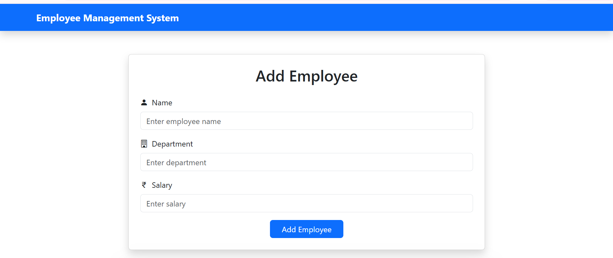
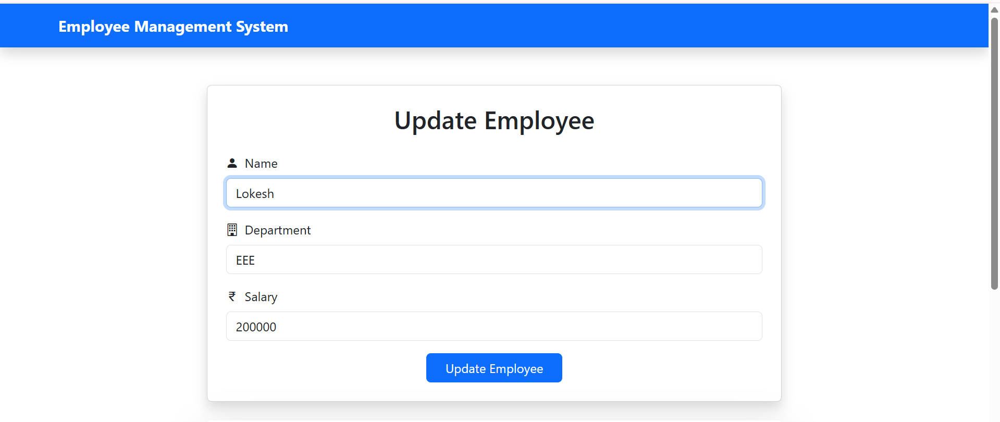
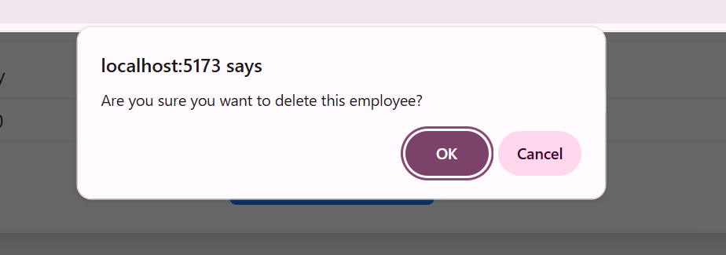
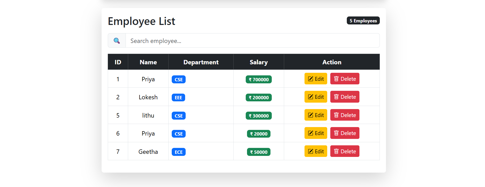
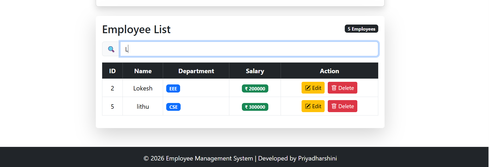

# Employee Management System - Frontend

A responsive Employee Management System frontend built with React.js.

## 🚀 Features

- Add Employee
- Update Employee
- Delete Employee
- Search Employee
- Responsive UI using Bootstrap
- Component-based architecture
- React Hooks (useState, useEffect)
- Axios integration with Spring Boot REST APIs

## 🛠️ Technologies Used

- React.js
- JavaScript (ES6+)
- Bootstrap 5
- Axios
- HTML5
- CSS3
- Vite

## 📂 Project Structure

```
src/
├── components/
│   ├── EmployeeForm.jsx
│   ├── EmployeeFormFields.jsx
│   ├── EmployeeTable.jsx
│   └── SearchBar.jsx
├── services/
├── App.jsx
└── main.jsx
```

## ▶️ Run the Project

1. Install dependencies

```bash
npm install
```

2. Start the development server

```bash
npm run dev
```

The application will be available at:

```
http://localhost:5173
```

## 📸 Screenshots

### Add Employee



### Update Employee



### Delete Confirmation



### Employee List



### Search Employee



## 👩‍💻 Developed By

**Priyadharshini**